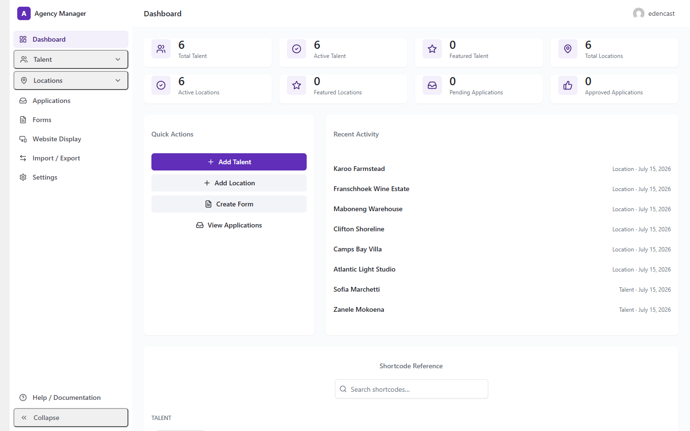
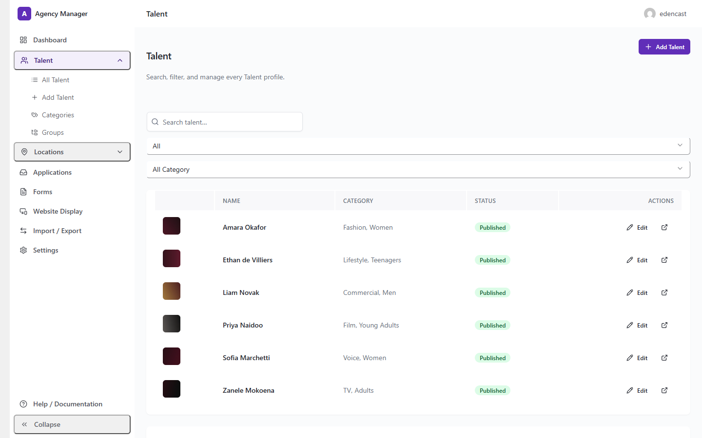
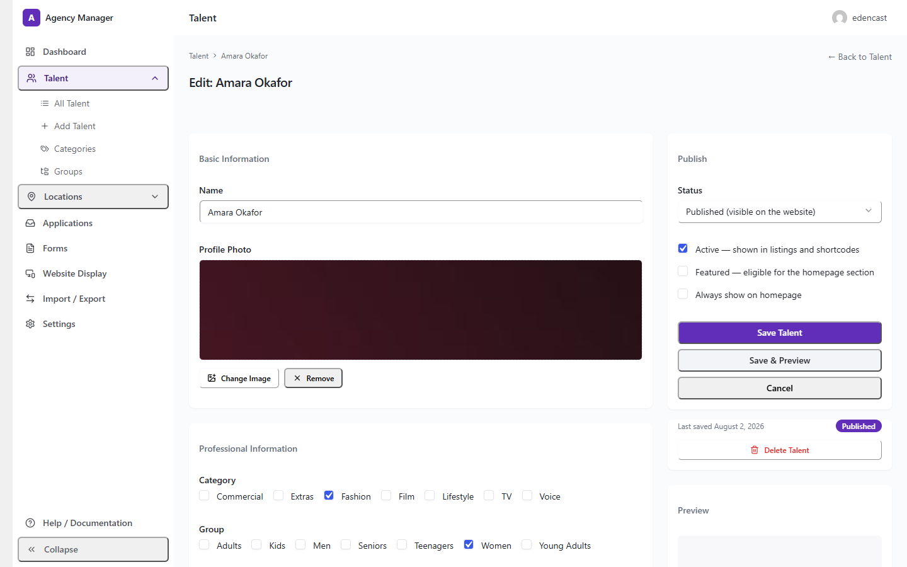
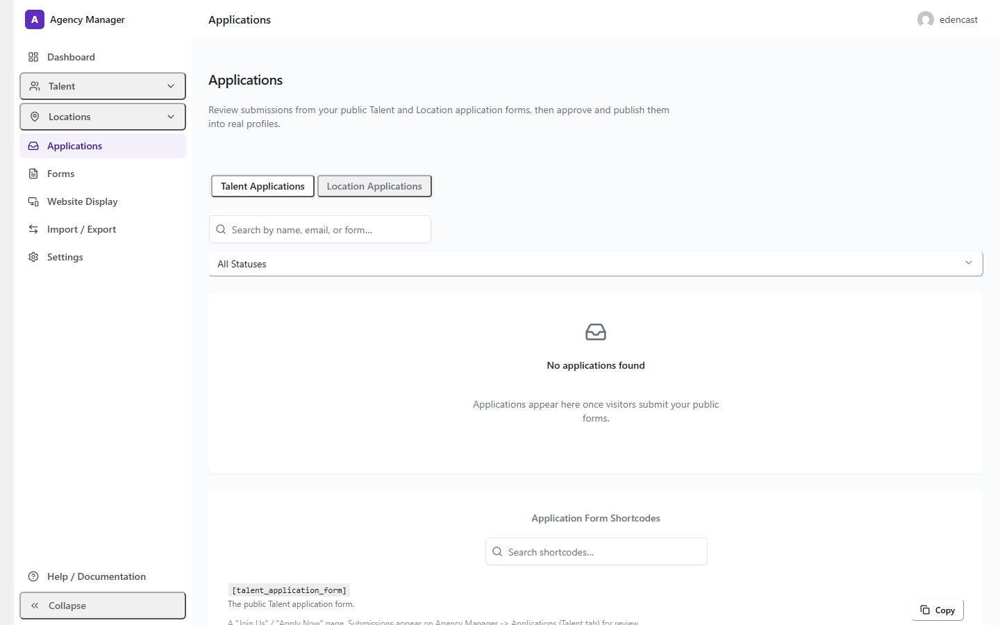
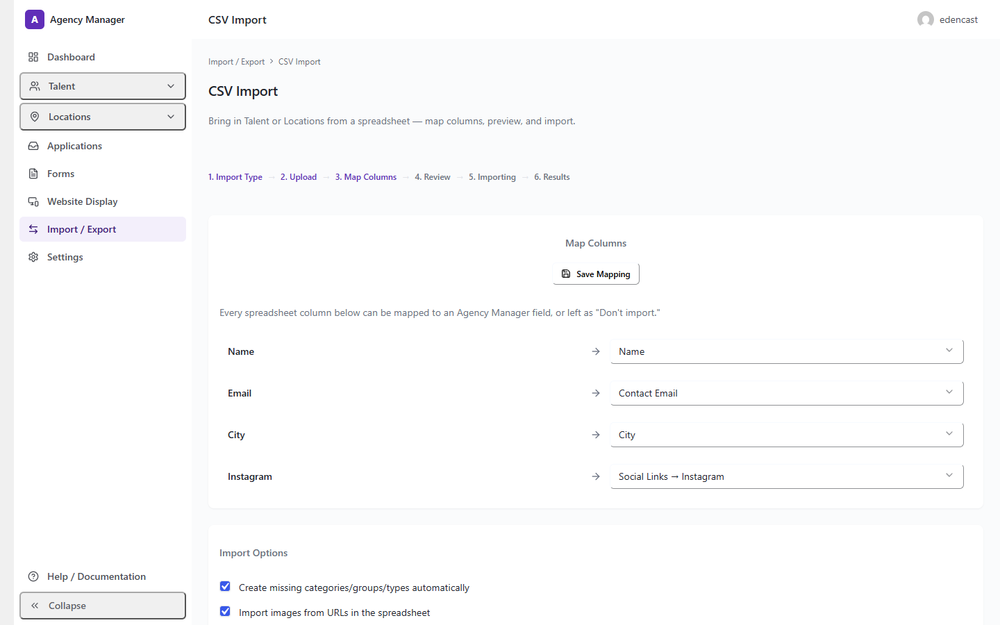
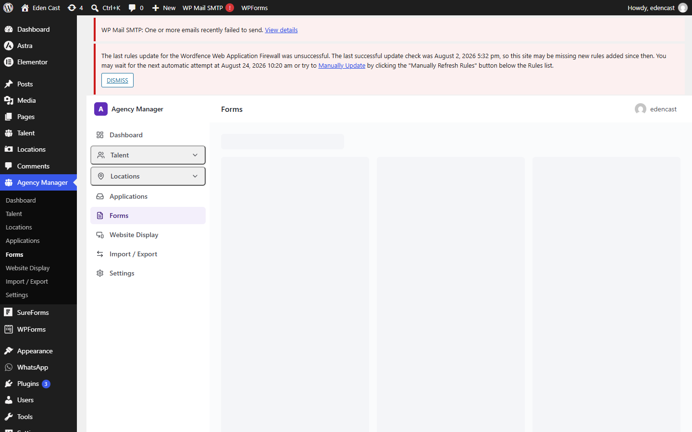

# Agency Manager

Talent, casting, and location management for agency websites — Talent/Location profiles, public application forms, CSV import, and Elementor widgets, from one WordPress admin screen.

**Version:** 1.6.4
**Requires:** WordPress 6.0+, PHP 7.4+ (tested on 8.2)
**License:** GPLv2 or later

---

## Overview

Agency Manager turns "Talent" and "Location" into first-class content types for a talent, casting, or location agency running on WordPress — with a full admin application, public application forms with a review workflow, bulk CSV import, and Elementor/shortcode display — instead of a raw custom post type with a bare admin screen bolted on.

It's built to be **theme-neutral and standalone**: on activation it checks whether a `talent`/`location` post type or taxonomy already exists (for example, one a theme already registers) and automatically defers to it rather than creating a conflicting duplicate, so it can also slot into a site that already has its own Talent/Location system.

## Features

- **Admin application** — Dashboard, Talent, Locations, Applications, Forms, Website Display, Import/Export, and Settings as one React/Tailwind interface, built on top of standard WordPress custom post types, taxonomies, and post meta (no custom database tables).
- **Talent & Location management** — add/edit screens (Basic Info, Professional Info, Media/Gallery, Social Links, Availability, Visibility) with a live preview using the actual public card template.
- **Applications** — review public form submissions through a Submitted → Review → Approved → Published workflow.
- **Form Builder** — a drag-and-drop editor (Field Library / Canvas / Field Settings) for the public Talent Application and Location Submission forms, with field-level mapping straight into Talent/Location profile fields.
- **CSV Import** — an upload → column-mapping → preview → import wizard for bulk-importing Talent or Locations from a spreadsheet, with duplicate detection (create/update/skip), optional taxonomy auto-creation, and image download from URLs in the spreadsheet. Where the server's PHP image library supports it, downloaded images also get WebP-optimized derivative sizes, while the original uploaded file is always kept unchanged.
- **Website Display** — a Display Mode (Hidden / Now Scouting / Live), an editable "Now Scouting" placeholder manager, and homepage featured-content control, per content type.
- **Shortcodes** — `[talent_grid]`, `[talent_featured]`, `[talent_carousel]`, `[talent_slider]`, the matching Location shortcodes, and form shortcodes, with `category`, `group`, `type`, `columns`, `only_featured`, `only_active`, and `order` parameters.
- **Elementor widgets** — Talent/Location Grid, Carousel, Slider, and Featured widgets, plus the Talent Application and Location Submission form widgets. Elementor is entirely optional — every widget also exists as a shortcode.
- **Import / Export** — a versioned JSON schema for Talent, Locations, taxonomies, Forms, and settings, matched by slug so re-importing the same file updates existing records instead of duplicating them.

## Screenshots

### Dashboard


### Talent Management



### Applications


### CSV Import


### Form Builder


More screenshots — including Locations, Website Display, Import/Export, the Shortcode Reference panel, and the public-facing Talent/Location cards and profiles — are in [`docs/screenshots/`](docs/screenshots/).

## Installation

### From the production ZIP (recommended for most sites)

1. In your WordPress admin, go to **Plugins → Add New → Upload Plugin**.
2. Choose the Agency Manager ZIP file and click **Install Now**.
3. Click **Activate**.
4. You'll be redirected to the Setup Wizard automatically.

### From this repository (for development or a manual install)

1. Clone or download this repository.
2. If you need to rebuild the compiled admin application, run the build step — see [Development](#development) below. The repository already includes a compiled `build/` directory, so this step is only needed if you're changing the React source.
3. Place the resulting folder in `wp-content/plugins/agency-manager/` on your WordPress site.
4. Activate **Agency Manager** from the Plugins screen in wp-admin.

This repository does **not** provide WordPress.org's own update mechanism — a site running a copy installed this way won't receive automatic updates through wp-admin the way a WordPress.org-hosted install does.

## Development

### Prerequisites

- WordPress 6.0+
- PHP 7.4+
- Node.js and npm (for the React admin application build)

### Setup

```bash
npm install
```

### Build commands

These are the actual scripts defined in `package.json`:

```bash
npm run build   # wp-scripts build — production build of the admin application into build/
npm start        # wp-scripts start — development build with file watching
```

### `src/` → `build/`

The React/Tailwind admin application's source lives in `src/admin-app/`. Running `npm run build` (via [`@wordpress/scripts`](https://www.npmjs.com/package/@wordpress/scripts), which wraps webpack) compiles it into `build/index.js`, `build/index.asset.php` (the WordPress script-dependency manifest), and `build/style-index.css`. The PHP side (`includes/admin/class-admin-app-page.php`) enqueues those compiled files directly — it never reads from `src/` at runtime. The compiled `build/` output is committed to this repository alongside its source so the plugin is directly usable without a build step, while still giving reviewers and contributors the actual source it was built from.

No CDN dependency is introduced anywhere — React, ReactDOM, and `@wordpress/api-fetch` are externalized to WordPress's own bundled copies of those libraries at build time, not fetched from a CDN at runtime.

See [`docs/DEVELOPMENT.md`](docs/DEVELOPMENT.md) for more detail, and [`docs/ARCHITECTURE.md`](docs/ARCHITECTURE.md) for how the pieces fit together.

## WordPress.org

This repository is the public source repository for Agency Manager. The WordPress.org plugin-directory listing (once published) uses [`readme.txt`](readme.txt), not this file — `readme.txt` follows WordPress.org's own readme format (plugin metadata, description, installation, FAQ, Privacy, External Services, Changelog) and is the version that renders on the plugin's WordPress.org page. `README.md` (this file) is for developers and contributors browsing the repository on GitHub.

WordPress.org's own marketing assets for the plugin listing (banner, icon, and the plugin-directory screenshots) are maintained separately, in the WordPress.org SVN repository's `assets/` directory — that is **not** the same as this repository's `docs/screenshots/` folder, which exists for this README and for developers browsing the repository.

## License

Agency Manager is licensed under the GPLv2 or later.

## Support

For support, please use the GitHub Issues page to report bugs, request improvements, or ask questions about the plugin.

## Contributing

Contributions are welcome. Please open an issue first to discuss significant changes before submitting a pull request.
